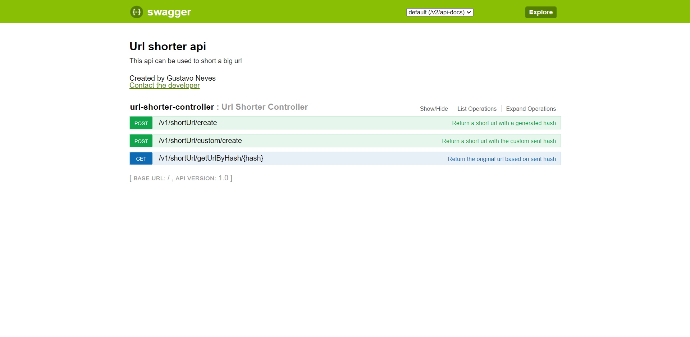

# URL Shorter

You can use this service to turn large urls into small urls

## Build a jar and run it

To run this application you can just use this docker-compose file, save it in your computer as docker-compose.yml and type docker-compose up in the command line interface.

```yaml
version: "3"
services:
  shorterurlapp:
    image: gustavon/shorterurlapp:latest
    container_name: shorterurlapp
    ports:
      - 8085:8085
    restart: unless-stopped
    depends_on:
      - db
    environment:
      - SPRING_DATASOURCE_URL=jdbc:postgresql://db:5432/shorterurldb
      - SPRING_DATASOURCE_USERNAME=postgres
      - SPRING_DATASOURCE_PASSWORD=postgres
      - SPRING_JPA_HIBERNATE_DDL_AUTO=create
    networks:
      - app-network
  db:
    image: postgres:latest
    container_name: db
    volumes:
      - pgdata:/var/lib/postgresql/data
    ports:
      - 5432:5432
    environment:
      - POSTGRES_PASSWORD=postgres
      - POSTGRES_USER=postgres
      - POSTGRES_DB=shorterurldb
      - PGDATA=/var/lib/postgresql/data/pgdata
    restart: unless-stopped
    networks:
      - app-network

networks:
  app-network:
    driver: bridge

volumes:
  pgdata:
```

## Apis
To see the api documentation and try out you can access http://localhost:8085/swagger-ui.html after run the docker-compose above



### Run the application locally
If you can checkout this application and run locally, you can use the docker-compose bellow instead of the above one


```yaml
version: "3"
services:
  db:
    image: postgres:latest
    container_name: db
    volumes:
      - pgdata:/var/lib/postgresql/data
    ports:
      - 5432:5432
    environment:
      - POSTGRES_PASSWORD=postgres
      - POSTGRES_USER=postgres
      - POSTGRES_DB=shorterurldb
      - PGDATA=/var/lib/postgresql/data/pgdata
    restart: unless-stopped
    networks:
      - app-network

networks:
  app-network:
    driver: bridge

volumes:
  pgdata:
```


## Info
Steps to generate a spring-boot docker image and push to your docker hub

 ```
 //Build new imagem of your spring-boot application
 docker build -f Dockerfile -t shorterurlapp . 
 docker-compose build
 
 //login into your docker-hub
 docker login
 
 //Create a tag for your image
 docker tag shorterurlapp <your docker hub username>/shorterurlapp:latest
 
 //Push to your docker hub
 docker push <your docker hub username>/shorterurlapp:latest
 ```
